# CNC-pen-plotter
## Brief Overview
Custom 2-axis CNC pen plotter designed and built from the ground up. Features belt-driven X/Y motion with stepper motors, Arduino/GRBL control, and a workflow using Fusion 360, Inkscape, and UGS.

## Finished project

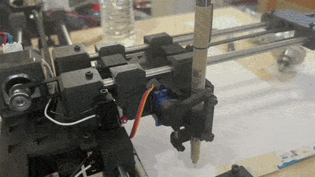

## Project Goals
- Design and build a functional 2D CNC plotter from scratch
- Learn CNC motion control and G-code
- Design the mechanical components using Fusion 360
- Implement belt-driven X/Y motion
- Control stepper motors using an Arduino
- Develop a machine capable of accurately drawing programmed designs

## Timeline/Milestones
1. Designed, fabricated, and assembled first carriage

   The Challenge
   > Learning cad from scratch and gauging dimensions for the holes for inserting the lm8uu linear bearings
   > After many test prints and utilizing a digital caliper I was finally able to achieve a viable test print.

   
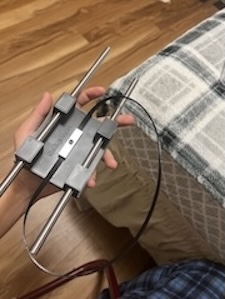 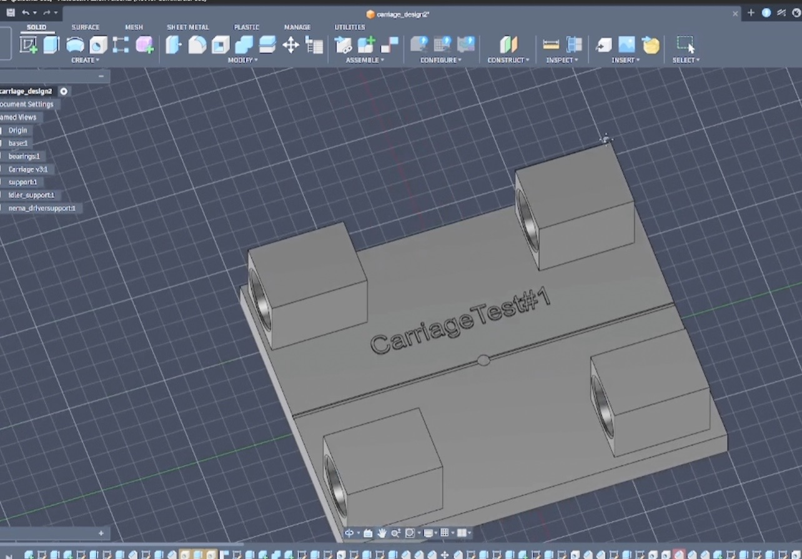

-----------------------------------

2. Assembled my first sliding mechanism

 > Nothing too crazy here, just fabricated some basic supports to hold the 400x8mm steel rod and inserted the carriage in between to build the sliding frame.

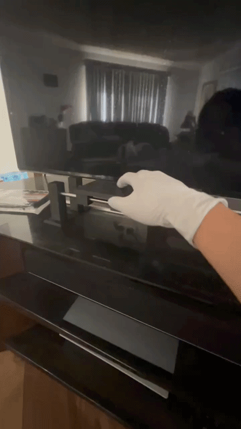

-----------------------------------

3. First axis complete

   > Assembled the carriage, supports, the idler pulley and nema mount structure (v1) to a 8mm plywood base with m5 screws. Used a metal piece that came with a gt2 kit to clamp the two ends of the belt to the carriage.

   The Challenge
   > Definitely trying to make sure everything was leveled so that the belt had proper tension, After adjusting the belt length and the clamp, I finally was able to get my first axis working.

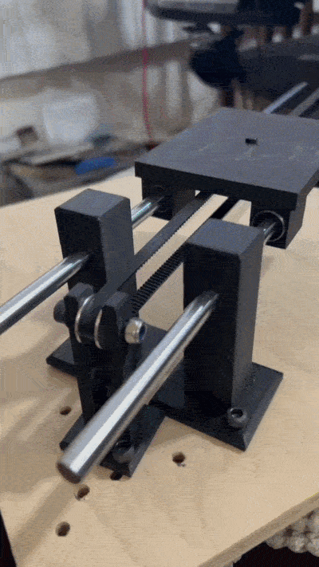. 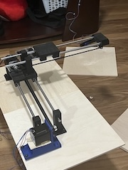

-----------------------------------

4. Second axis complete

   > Redesigned the first carriage to add screw holes to mount supports (stacking the second axis on top of the first carriage)

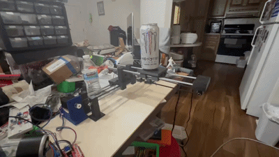. 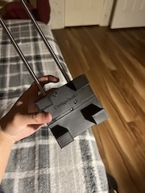

-----------------------------------

5. Pen module servo linkage mechanism

   > For the pen module, I decided to go with a servo linkage mechanism, where I fabricate a custom servo horn, thats screwed to a little linkage rod and it pulls the pen holder up and down. The movement is restricted using 3mm steel rods that have been cut down in length.

   > Hooked up to an arduino and the side of my desk to test and it does work.

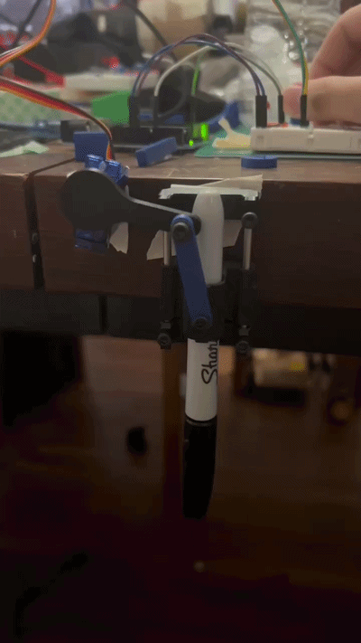 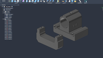

-----------------------------------

6. Carriage REVAMP and reassembly

   > First version designs were merely just for POC and functionality. Now that I now that it does work, it is time to redesign to make them more polished and professional.
   > Utilized more of the filet and chamfer tools and a few designs to save material.
   > Reassembled everything on a different base (6mm birchwood) because it was cheaper and I needed 2x2
   > Attached the new carriages and screwed on the pen module on the second carriage.
   > At this point most of the mechanical stuff is done

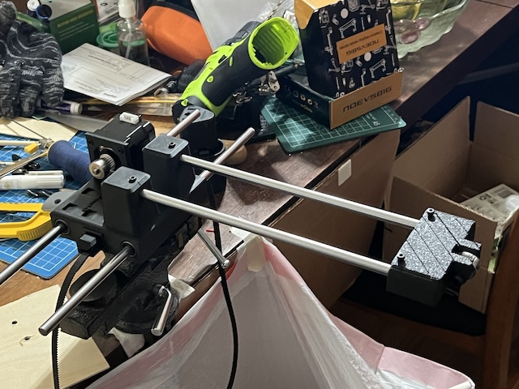  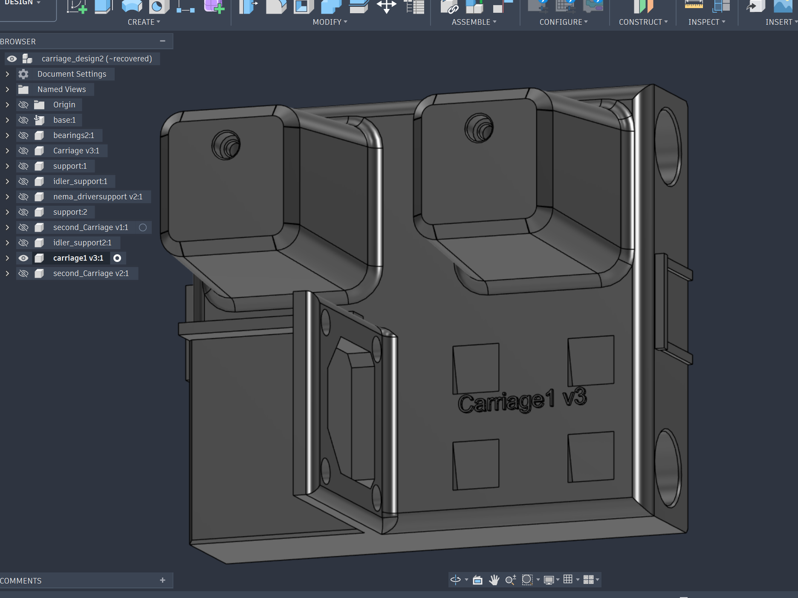 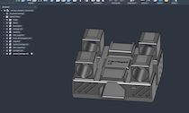 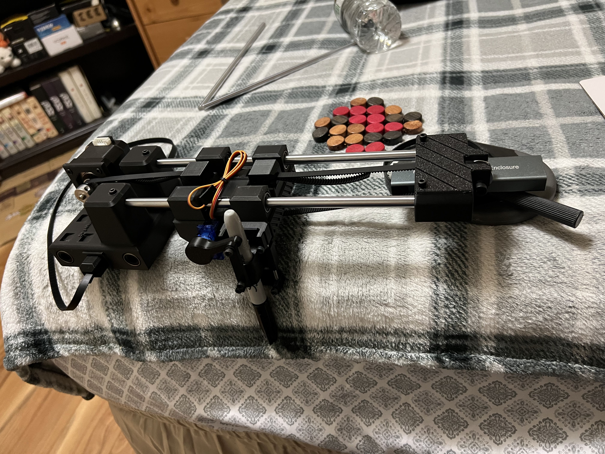

