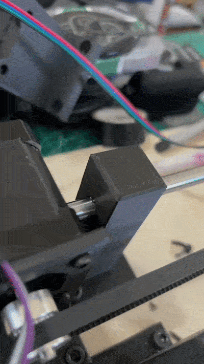
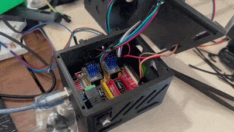
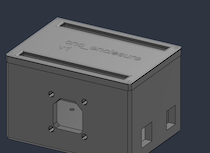
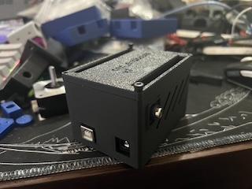
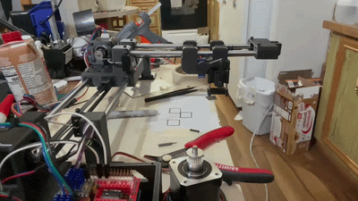
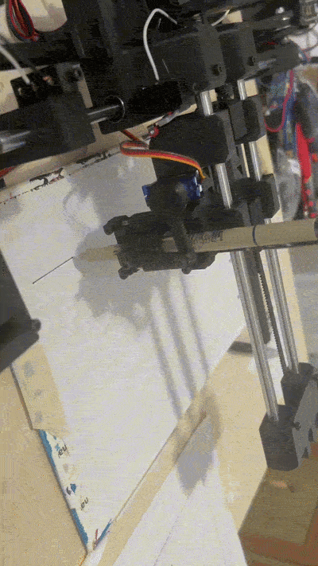

# CNC-pen-plotter
## Brief Overview
Custom 2-axis CNC pen plotter designed and built from the ground up. Features belt-driven X/Y motion with stepper motors, Arduino/GRBL control, and a workflow using Fusion 360, Inkscape, and UGS.

## Finished project

## Project Goals
- Design and build a functional 2D CNC plotter from scratch
- Learn CNC motion control and G-code
- Design the mechanical components using Fusion 360
- Implement belt-driven X/Y motion
- Control stepper motors using an Arduino
- Develop a machine capable of accurately drawing programmed designs

## Mechanical components 
-  LM8UU Linear Bearings (25mm,45mm)
-  Steel rods (400mm, 250mm)
-  6mm GT2 timing belt
-  20t pulley
-  idler pulley
-  6mm birchwood base
-  M3 and M5 screws, nuts, and locknuts
  
-----------------
## Custom-designed mechanical components
- ground rod supports (screwed supports to the birchwood base
- ground idler support (belt wraps around the idler pulley)
- Carriage X axis (Carries the y axis)
- Carriage Y axis (Carries the pen module)
- Y Axis idler support 
- electronics housing (to hold the CNC shield and cool it)
- limit switch holders (To hold the limit switches, which is super glued to the machine)
- Belt clamps (glued to the carriages for a more integrated design, holds onto the belt ends)
- Stepper mounting structure (NEMA stepper is screw mounted)

## Electronics
- Arduino UNO R3
- NEMA 17 stepper motors
- CNC shield
- SG90 hobby servo
- 5V 30mm fan
- Limit switches

## Software
- Inkscape
- Arduino IDE
- Universal G-code Sender (UGS)
  
### How Does It Work?

Inkscape is used to create the drawing and generate the G-code. UGS (Universal G-code Sender) sends the G-code to the Arduino running GRBL. GRBL interprets the commands and sends STEP/DIR signals through the CNC shield to the TMC2209 stepper drivers. The drivers control the NEMA 17 stepper motors, which move the X/Y carriages through the GT2 belt system. A servo linkage controls the pen's up/down movement.

## Timeline/Milestones
1. Designed, fabricated, and assembled first carriage

   
 

-----------------------------------

2. Assembled my first sliding mechanism

 > Nothing too crazy here, just fabricated some basic supports to hold the 400x8mm steel rod and inserted the carriage in between to build the sliding frame.

-----------------------------------

3. First axis complete

   > Assembled the carriage, supports, the idler pulley and nema mount structure (v1) to a 8mm plywood base with m5 screws. Used a metal piece that came with a gt2 kit to clamp the two ends of the belt to the carriage.

. 

-----------------------------------

4. Second axis complete

   > Redesigned the first carriage to add screw holes to mount supports (stacking the second axis on top of the first carriage)

.  

-----------------------------------

5. Pen module servo linkage mechanism

   > - For the pen module, I decided to go with a servo linkage mechanism, where I fabricate a custom servo horn, thats screwed to a little linkage rod and it pulls the pen holder up and down. The movement is restricted using 3mm steel rods that have been cut down in length.

   > - Hooked up to an arduino and the side of my desk to test and it does work.

 

-----------------------------------

6. Carriage REVAMP and reassembly

   > - First version designs were merely just for POC and functionality. Now that I now that it does work, it is time to redesign to make them more polished and professional.
   > - Utilized more of the fillet and chamfer tools and a few designs to save material.
   > - Reassembled everything on a different base (6mm birchwood) because it was cheaper and I needed 2x2
   > - Attached the new carriages and screwed on the pen module on the second carriage.
   > - At this point most of the mechanical stuff is done

     

-----------------------------------

7. Electronics housing design
    
    > - Holds the Arduino and CNC shield
    > - Installed a 5v 30mm fan to cool the stepper drivers
    > - Added some side vents for better cooling

  . 
    

8. Homing and servo calibration
   
   > - Looked up the official GitHub and uploaded the firmware to my Arduino.
   > - Used the Serial monitor to test out some $commands
   > - Calibrated homing switches
   > - Calibrated $$ (settings) to correct stepper direction and speed for homing sequence
   

-----------------------------------

9. Actually good tracing AND filling

   > - Downloaded Inkscape to create g-code
   > - Downloaded UGS (universal g-code sender) to send and trace g-code.
   > - Woodglued 2 more 12x12, 6mm birchwood to expand canvas.
   > - Added and tuned a paper bed for more consistent tracing
   > - Switched from fine tip sharpie to a micron pen for cleaner strokes.

   

----------------------------
## Challenges and Solutions

1. Gauging dimensions for the holes to fit my LM8UU bearings
   > - Utilized a digital caliper and printed many test prints to find a suitable fit

2. Adjusting belt tension and alignment
   > -  Designed a custom clamp that allows the belt tension to be adjusted, zip ties are used to prevent any teeth slip

3. Servo linkage alignment
   > - Added multiple mounting holes and space for the pen module for flexibility. Extruded the region around the screw hole until the linkage rod is aligned with the servo horn (misalignment creates twisting.

4. Carriage redesign
   > - First few versions were good for proof of concepts and pure functionality; however, lacked mounting features needed for the final machine and were rather blocky. Final versions used more chamfers and fillets and other material-saving features. Addtionally, added some areas for mounting clamps and the pen module. Design was a lot more integrated so less screws were needed.

5. Homing calibration
   > - Configured the GRBL settings and calibrated the limit switches.

6. Pen consistency / drawing quality
   > - Used a finer tip micron pen for cleaner strokes.
   > - Added a bed for the paper for a more consistent drawing surface
   > - Configured servo pen up and down settings to reduce drag 

7. Stepper driver cooling
   > - Swapped from DRV8825 stepper drivers to TMC2209 for more efficient signals
   > - Electronic housing has a screwed on 5v 30mm fan that cools the heatsinks
   > - Housing has side vents for better cooling.
   

----------------------------

## What I Learned
- CAD design, including chamfers, fillets, mounting holes, and iterative prototyping
- Using stepper motors and GT2 belt drives for linear motion
- Creating and sending G-code using Inkscape and UGS
- Converting servo rotation into linear motion using a linkage mechanism and guide rods
- Using linear ball bearings to reduce friction and guide carriage movement
- Using a CNC shield and stepper drivers to control NEMA 17 motors
   
   
